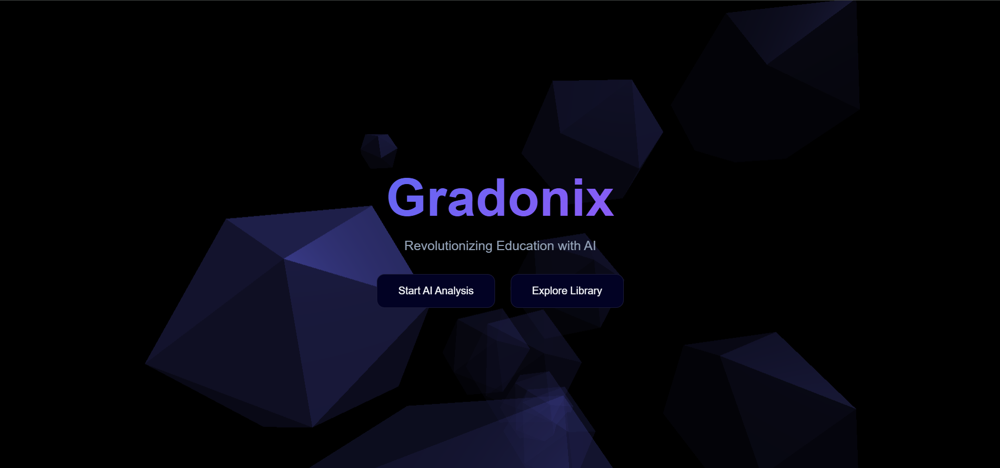

# Gradonix

A web application that uses AI to generate a study plan and tracks progress. The application is designed for students to access Library and is built using HTML, CSS, JavaScript, and Three.js.

## Features

* AI generated study plan
* Progress tracking
* Free Library access
* 3D background with animated particles

## Screenshots

## Technologies Used

* Three.js
* JavaScript
* HTML
* CSS

## Installation

1. Clone the repository
2. Run `npm install`
3. Run `npm start`
4. Add your Gemini api key

## Usage

1. Open the application in a web browser
2. Enter your class and chapter
3. Click on the "Generate Study Plan" button
4. The application will generate a study plan and study table then it display
5. Track your progress and view your progress chart
6. Can access free Library with search of book Name and subject.

## Contributing

Contributions are welcome! If you have any suggestions or bug fixes, please open an issue or pull request.

## License

This project is licensed under the MIT License. See the [LICENSE](https://github.com/aryan9600/Gradonix/blob/master/LICENSE) file for details.
